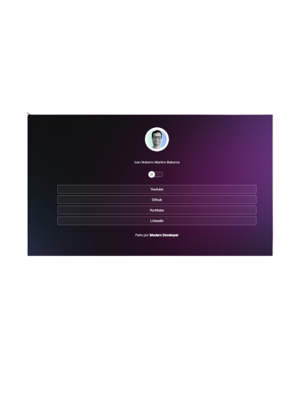

# Project title

Link tree.

# License

**Only inspiration**

---

# Tools used

 
 
Javascript + html + css

# Description

Linktree created to present my communication networks.

---

**Screen 📷**

# 

# project on Github Pages:

https://ivanmartins090317.github.io/linktree/
